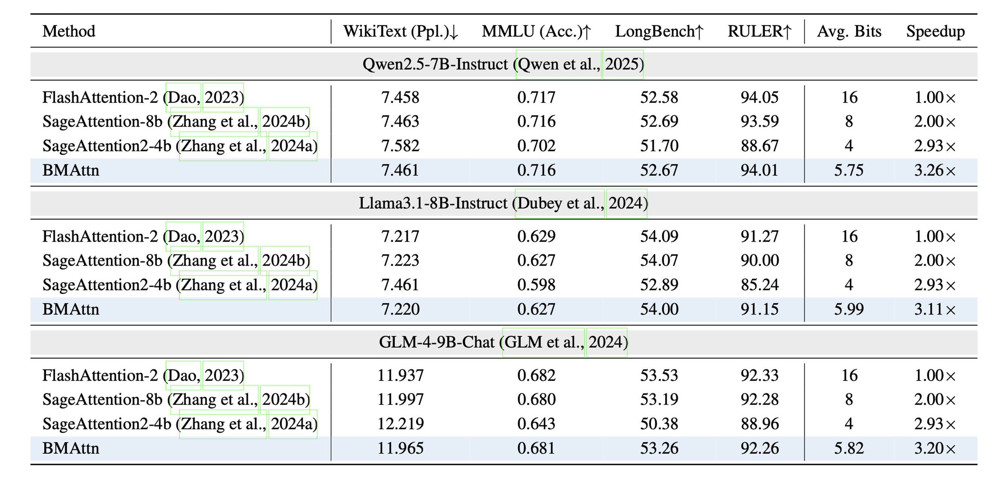
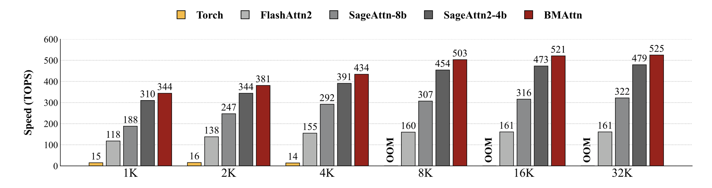
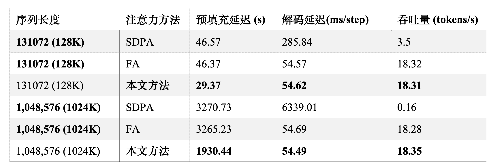

# LongContext_SQAttn_paddle

> **2024 CCF–百度松果基金 · 大语言模型的超长上下文高性能推理技术研究** 配套代码库。

面向超长上下文推理的 **PaddlePaddle** 实现，内置 **SQAttn** 加速注意力内核，支持 **CPU–GPU 混合推理** 与 **百万级（最多 1,024K）上下文** 场景，覆盖基准评测与对比方法（FlashAttn、SDPA）。

---

### 特性

* **SQAttn 加速内核**：针对长序列场景优化的注意力计算。
* **混合执行**：CPU–GPU 协同，提高吞吐与显存利用率。
* **可复现实验**：一键脚本跑通 RULER/合成数据基准。
* **对比齐全**：支持 `FlashAttn`、`SDPA` 作为基线。

---

### 环境准备

#### 1) 创建 Conda 环境（Python 3.10）

```bash
conda create -n sqattn python=3.10 -y
conda activate sqattn
```

#### 2) 安装依赖

```bash
pip install -r requirements.txt
```

> **安装 PaddlePaddle GPU 3.2.0（以 CUDA 12.6 为例）**

```bash
python3 -m pip install paddlepaddle-gpu==3.2.0 \
  -i https://www.paddlepaddle.org.cn/packages/stable/cu126/
```

---

### 快速开始

#### 一键运行

```bash
bash run_ruler.sh
```


#### 部分脚本参数说明（`run_ruler.sh`）

* `MAX_SEQ_LENGTH=131072`
  序列长度（可根据显存与评测需求调整；示例为 131072）。

* `BENCHMARK=synthetic`
  评测数据来源。`synthetic` 表示生成数据基准。

* `ATTN_TYPE=SQAttn`
  选择注意力实现。可选项：

  * `SQAttn`（本项目提出的方法，默认）
  * `FlashAttn`（对比方法）
  * `SDPA`（对比方法）

* `ROOT_DIR="./benchmark/ruler/ruler_eval_result"` 中间产物路径。

---

### 实验结果

- 文本类测试集评测准确率


- 注意力内核测速对比



- 超长上下文推理测速对比


---

### 致谢与资助

本项目受 **2024 CCF–百度松果基金**「大语言模型的超长上下文高性能推理技术研究」课题资助。感谢社区和 PaddlePaddle 官方对FlashAttention、SDPA 等开源工作的贡献。

